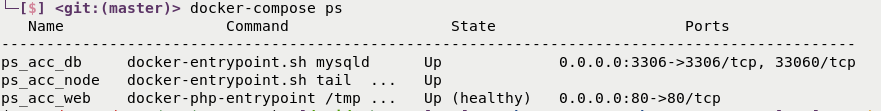

# PrestaShop Account

## Community Service & PrestaShop X modules

To work as a Community Service or as PrestaShop X, a module needs three parts:

### [module ps_accounts](http://github.com/PrestaShopCorp/ps_accounts)

- Contains all the controllers

### [library npm](http://github.com/PrestaShopCorp/prestashop_accounts_vue_components)

- Contains all the vuejs components to manage onboarding

### [library composer](http://github.com/PrestaShopCorp/prestashop_accounts_auth)

- Wraps all the calls to ps_accounts
- Contains all the Firebase logic

## Installation of all projects

First run prepare,

```bash
export UID=<current_user_id> # id -u  find user id on linux/mac
export GID=<current_group_id> # id -g find group id on linux/mac
bash ./init-full-accounts.sh prepare /path/to/install
```

WARNING : /path/to/install directory MUST be empty.

You will need ngrok on port 80 to have customized DN for PS shop software (PS_DOMAIN var)

Then customize

- /path/to/install/ps_accounts/docker-compose.override.yml
- /path/to/install/ps_accounts/.env :
  - use a public DN in PS_DOMAIN (ngrok or real DN, no local ones)
  - fix \*\_PATH vars to match your /path/to/install
  - fix UID var to match <current_user_id>
  - fix GID var to match <current_group_id>
  - fix FIREBASE\_\* vars to use the right environment
- /path/to/install/services/apps/accounts/ui/.env (copy from .env.example)
  - Fill empty vars
- /path/to/install/services/apps/accounts/api/.env (copy from .env.example)
  - Fill empty vars
- And add /path/to/install/services/gcp-credentials.json

Finally, run install

```bash
bash ./init-full-accounts.sh install /path/to/install
```

## Installation

Clone the repo if not already done

```bash
git clone git@github.com:PrestaShopCorp/prestashop_accounts_auth.git
git clone git@github.com:PrestaShopCorp/ps_checkout.git
make init
```

/!\ Minimal customize .env with path of dependencies, current user id, current group id and fix FIREBASE\_\* vars to use the right environment

Customize docker-compose.override.yml for choice port

## Use of prestashop_accounts_auth as as local dev repository

In order to make this work we use an alternate composer.json file for development.

First make sure your VM has a `COMPOSER=composer-dev.json` defined in its environment :

The install script will :

1. copy composer.json into composer-dev.json;
2. append à "repositories" entry with the local repository of type "path" pointing where it is mounted on local filesystem;
3. replace the dependency version number with the one checked out locally :
   - in case git is not installed in the VM :
     `dev-master`
   - in case git is installed in the VM :
     `dev-[git_branch_name]`

At this point composer will use dependencies from local repository and update its dependencies accordingly.

In order to update alternate composer-dev.json in case composer.json has been updated you can run `make restart`.

## Usage

List all Makefile rules

```bash
make
```

Start project :

```bash
make start
```

Wait container be to state `healthy`

For watch docker-compose status run `watch docker-compose ps`



If you need to offboarding open new tabs in your browser go to `<bo_url>/index.php/?controller=AdminResetOnboarding&psAccountsToken=Bk8dAsPCiiseVK7o` and click on `I understand the risks and I really want to display this page`

`/!\ WARNING` this url you offboarding all the PSX.

## Build dependencies

You need to reload prestashop_accounts_vue_components.

```bash
make build_node_deps
```

## CI

CI trigger on pull request labeled 'quality assurance needed'

To set custom checkout branch , edit [custom-checkout-version](custom-checkout-version)

## CD

Delivery is automated (see [.github/workflows]):

- bump version in the files (`ps_accounts.php`, `config.xml`) accordingly to the version you set in your release version
- build and customize (integration env) zips available as release assets
- ship the production zip to the addons marketplace

## How to connect ?

#### FRONT

```
FRONT URL   : http://localhost:<port>
User        : pub@prestashop.com
Pwd         : 123456789
```

#### BO

authentication

```
URL         : http://localhost:<port>/admin-dev
User        : demo@prestashop.com
Pwd         : prestashop_demo
```

or

```
http://127.0.0.1:<port>/admin-dev/index.php/module/manage?email=demo@prestashop.com password=prestashop_demo
```

#### DB

```
host        : localhost
port        : <port>
name        : prestashop
user        : macfly
password    : admin
prefix      : ps_
```

## Testing

Run php-cs-fixer

```bash
php vendor/bin/php-cs-fixer fix
```

Run phpstan for prestashop 1.6.1.0

```bash
docker run -tid --rm -v ps-volume:/var/www/html --name temp-ps prestashop/prestashop:1.6.1.0;

docker run --rm --volumes-from temp-ps -v $PWD:/web/module -e _PS_ROOT_DIR_=/var/www/html --workdir=/web/module phpstan/phpstan:0.12 analyse --configuration=/web/module/tests/phpstan/phpstan-PS-1.6.neon
```

Run phpstan for prestashop 1.7.0.3

```bash
docker run -tid --rm -v ps-volume:/var/www/html --name temp-ps prestashop/prestashop:1.7.0.3;

docker run --rm --volumes-from temp-ps -v $PWD:/web/module -e _PS_ROOT_DIR_=/var/www/html --workdir=/web/module phpstan/phpstan:0.12 analyse --configuration=/web/module/tests/phpstan/phpstan-PS-1.7.neon
```

## Firebase JWT tokens

To get Firebase ID and Refresh tokens you will need to make an API call to firebase

```text
https://identitytoolkit.googleapis.com/v1/accounts:signInWithPassword?key={{ssofirebaseApiKey}}

body : {
	"email": "{{email}}",
	"password": "{{userPassword}}",
	"returnSecureToken":true
}
```
